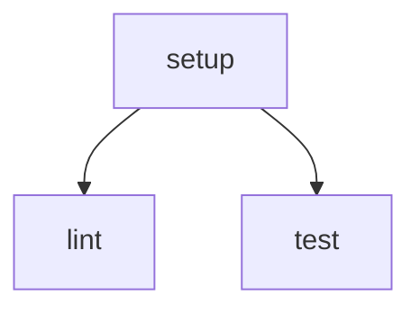

# GitHub Actions Workflow Documentation

This document describes the CI/CD workflow for the project.

## Overview

The workflow consists of three main jobs:

1. `setup`: Prepares the environment and installs dependencies
2. `lint`: Runs code quality checks
3. `test`: Executes tests in parallel

## Caching Strategy

The workflow implements a two-level caching strategy:

### 1. UV Cache

- Caches UV's dependency resolution cache
- Location: `~/.cache/uv`
- Key: `uv-{date}-{requirements.txt-hash}`
- Purpose: Speeds up dependency resolution

### 2. Virtual Environment Cache

- Caches the Python virtual environment
- Location: `.venv`
- Key: `venv-{uv-cache-key}`
- Purpose: Prevents rebuilding venv for each job

## Job Dependencies

- `setup` must complete before `lint` and `test` can start
- `lint` and `test` run in parallel

## Matrix Testing

The test job uses a matrix strategy to:

- Test against different Python versions
- Run tests in parallel
- Ensure consistent behavior across environments

## References

- [GitHub Actions Documentation](https://docs.github.com/en/actions)
- [UV Documentation](https://github.com/astral-sh/uv)
- [actions/cache Documentation](https://github.com/actions/cache)
- [Matrix Strategy Documentation](https://docs.github.com/en/actions/using-jobs/using-a-matrix-for-your-jobs)
