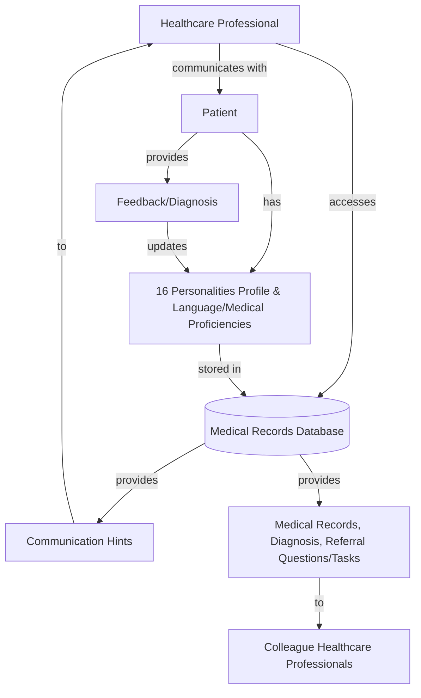

```mermaid
flowchart TD
    HealthcareProfessional[Healthcare Professional] -->|accesses| MedicalRecordsDatabase[(Medical Records Database)]
    Patient[Patient] -->|provides| Feedback[Feedback/Diagnosis]
    Patient -->|has| Profile[16 Personalities Profile & Language/Medical Proficiencies]
    Feedback -->|updates| Profile
    Profile -->|stored in| MedicalRecordsDatabase
    MedicalRecordsDatabase -->|provides| Hints[Communication Hints]
    Hints -->|to| HealthcareProfessional
    HealthcareProfessional -->|communicates with| Patient
    MedicalRecordsDatabase -->|provides| ProfessionalRecords[Medical Records, Diagnosis, Referral Questions/Tasks]
    ProfessionalRecords -->|to| ColleagueHealthcareProfessionals[Colleague Healthcare Professionals]
```
