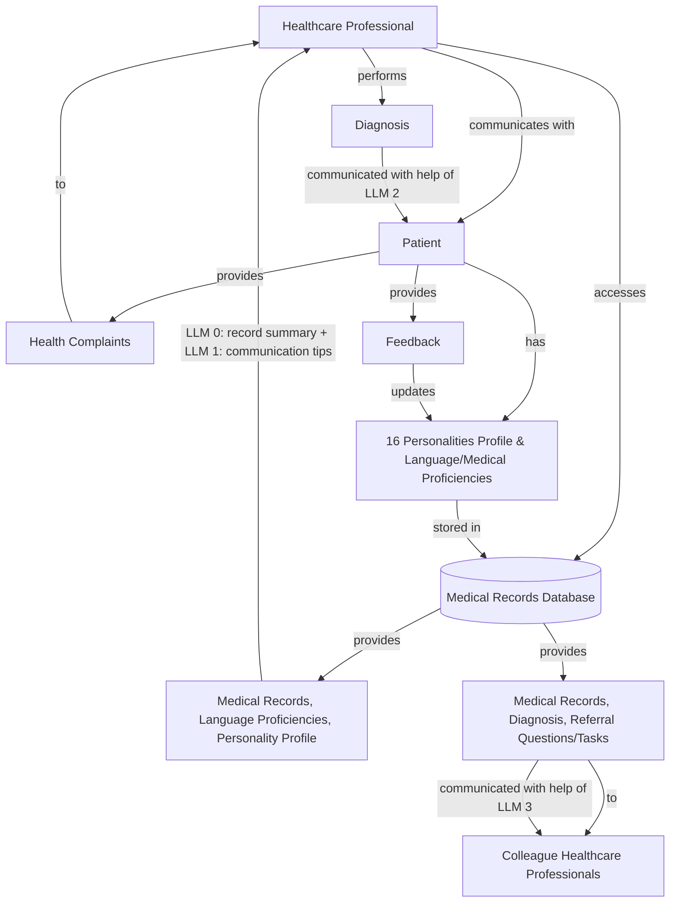

## Notes

- **Healthcare Professional**: Accesses medical records, language proficiencies, and personality profiles from the Medical Records Database. Optionally uses LLM 0 to summarize medical records. Gets communication suggestions for the Patient using LLM 1. Performs diagnosis and communicates results with help of LLM 2. Can communicate the same diagnosis and medical records to another Healthcare Professional using LLM 3.
- **Patient**: Provides health complaints and feedback to the Healthcare Professional. Has a profile that includes a 16 personalities profile and language/medical proficiencies.
- **Medical Records Database**: Stores medical records, language proficiencies, personality profiles, and feedback. Provides communication hints and professional records.
- **LLM 0**: Summarizes medical records.
- **LLM 1**: Provides communication suggestions for the Patient based on their profile and language proficiencies.
- **LLM 2**: Helps the Healthcare Professional communicate diagnosis results to the Patient.
- **LLM 3**: Helps the Healthcare Professional communicate diagnosis and medical records to another Healthcare Professional.
- **Colleague Healthcare Professionals**: Receive professional records, diagnosis, and referral questions/tasks from the Healthcare Professional.
