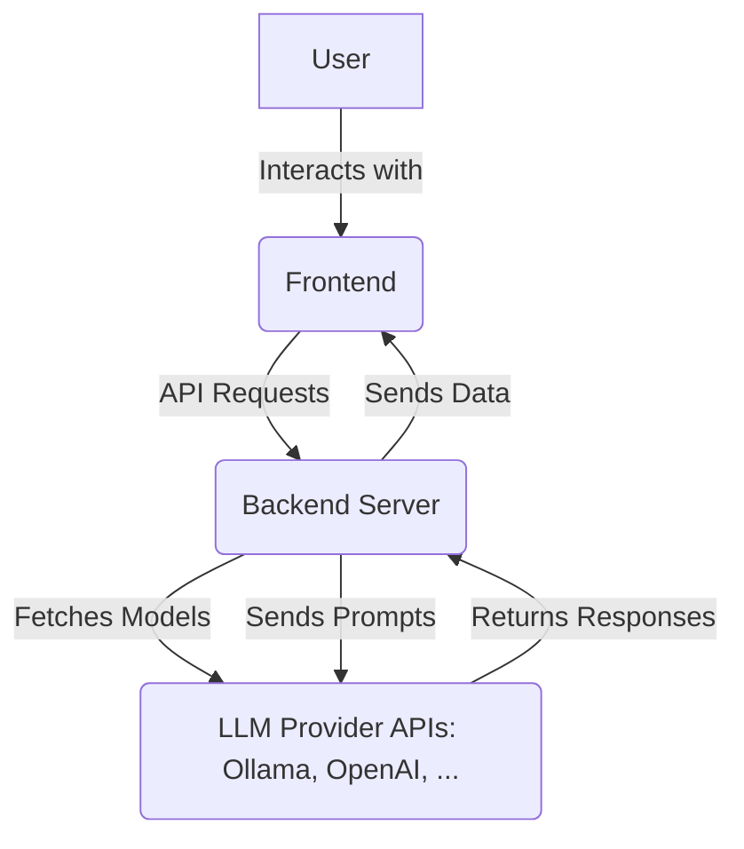

# Work Breakdown Structure

## Components

| Component        | Responsibilities                                                                                   | Interfaces                                           | Deployment | Notes                                                            |
| ---------------- | ---------------------------------------------------------------------------------------------------- | ---------------------------------------------------- | ---------- | ---------------------------------------------------------------- |
| **Frontend**     | - Display UI elements (dropdowns, text editors, output area). - Handle user interactions (button clicks, input). - Make API calls to the backend. - Render LLM output (text and code blocks). | - REST API (provided by the Backend Server)           | Local      | Runs in the user's browser.                                   |
| **Backend Server** | - Serve static frontend files (HTML, CSS, JS). - Handle API requests from the frontend. - Interact with LLM provider APIs. - Manage file saving.                        | - REST API (consumed by the Frontend) - LLM Provider APIs | Local      | Node.js server, runs on user's machine.                        |
| **LLM Providers** | - Provide LLM models and inference capabilities.                                                   | - Provider-specific APIs (e.g., Ollama API, OpenAI API) | External   | Accessed via HTTP requests from the Backend Server.              |
