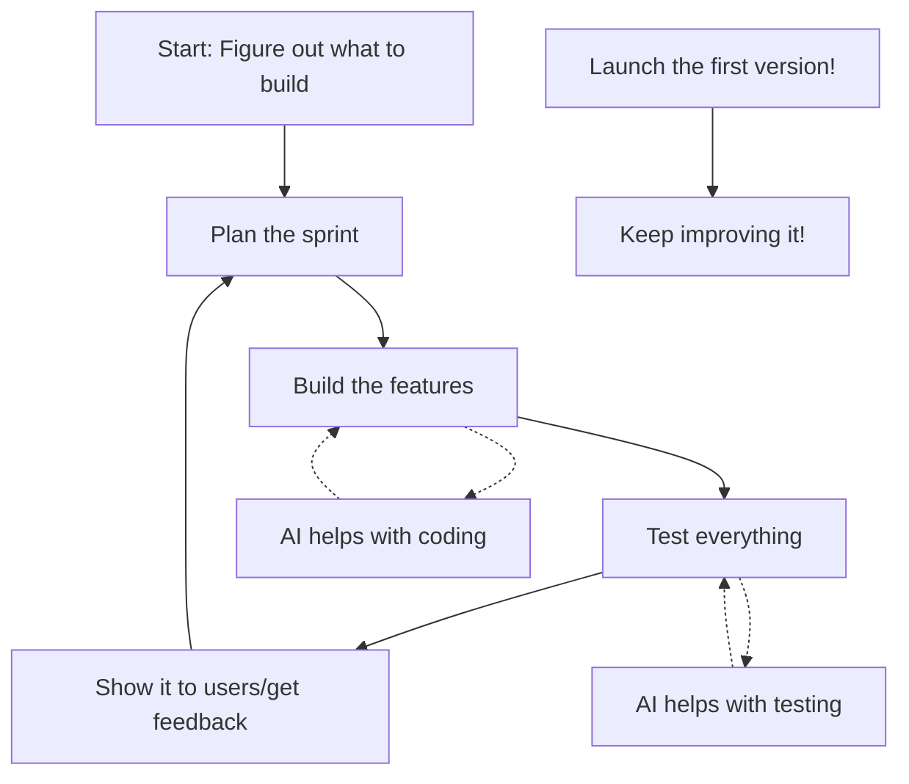

**Project: Building an AI Software Factory (The Factory is the First Product)**

**1. What We Need to Figure Out:**

*   **Main Goals:** What exactly do we want to achieve? (e.g., X users in Y months, $Z revenue in year one).
*   **Who Are We Building For?** Be super specific about our ideal first customers (e.g., small startups making image recognition apps).
*   **How Will We Make Money?** Subscription, pay-per-use, or something else?
    *   **Rules:** Do we need to follow any special rules (like for ethical AI or data privacy)?
    *   **Money:** How much do we have to spend at the start?
    *   **Time:** When do we need to launch a basic version?
    *   **Risks:** How much risk are we okay with? (This affects our tech choices).

**2. What's Good and Bad (SWOT):**

*   **Strengths:** We're good at AI and building software.
*   **Weaknesses:** We're new, and we need to figure out the specifics.
*   **Opportunities:** Lots of businesses need AI help.
*   **Threats:** Other companies are already doing this.

**3. How We'll Work (Agile):**

*   We'll use Agile (probably Scrum or Kanban). It's flexible and lets us change plans as we learn.
*   We'll work in short sprints (like 2 weeks) to build and test things quickly.
*   We need to adapt Agile to fit our specific needs.

**4. The Team:**

| Role             | What They Do                               | Skills Needed                               | Who They Report To | What They Deliver                                  | AI Can Help With                                  | Human Needs To Check |
|------------------|--------------------------------------------|-----------------------------------------------|--------------------|---------------------------------------------------|----------------------------------------------------|---------------------|
| Project Manager  | Keeps everything on track, budget, timeline | Managing people, handling risks               | Director           | Project plan, updates                             | Tracking progress, flagging risks                 | Big decisions, talking to people |
| AI/ML Engineer (2)| Builds the AI parts of the factory        | Machine learning, coding, specific AI tools   | Project Manager    | Working AI features, code, models               | Code generation, testing, finding bugs             | Model accuracy, ethical concerns |
| DevOps Engineer  | Sets up the servers and deployment         | Cloud services, automation, security           | Project Manager    | Infrastructure, deployment pipelines              | Automating tasks, monitoring system health        | Security checks, major changes |
| Business/Sales   | Finds customers, handles money            | Sales, marketing, understanding customer needs | Director           | Sales plan, customer contracts, revenue reports | Finding leads, drafting emails, analyzing sales data | Contracts, customer relationships |

**5. How We'll Build It (Process):**

*   Short sprints (2 weeks).
*   Daily quick meetings.
*   Decisions documented.
*   Process for handling changes.
*   Clear communication channels.
*   Humans and AI work together.

**6. Important Stuff (Cross-Cutting Concerns):**

| Thing          | How We'll Do It                                      | When to Think About It | Who's Responsible | AI Help?             | Human Check? |
|----------------|------------------------------------------------------|-----------------------|-------------------|----------------------|--------------|
| Monitoring     | Use tools to watch how the factory is performing.   | From the start        | DevOps            | Spotting problems    | Yes          |
| Auditing       | Keep track of changes.                               | From the start        | DevOps            | Logging              | Yes          |
| Localization   | Plan for different languages/regions later.          | Later                 | Project Manager    | Translation          | Yes          |
| Error Handling | Catch errors, log them, and fix them.                | Always                | All Engineers     | Finding bugs         | Yes          |
| Scaling        | Design to handle more users/data later.              | Architecture phase    | AI/ML Engineers   | Predicting needs     | Yes          |
| Security       | Build security in from the start.                   | Always                | All, esp. DevOps  | Threat detection     | Yes          |
| Accessibility  | Make it usable for everyone.                         | Design phase          | All               | Checking compliance  | Yes          |

**7. Risks:**

| Risk                 | How Bad? | How Likely? | What to Do to Prevent It               | What to Do If It Happens      | Who's In Charge? |
|----------------------|----------|-------------|----------------------------------------|-------------------------------|-------------------|
| API integration fails | High     | Medium      | Test early, use multiple APIs if possible | Find a different API, fix it | Tech Lead         |
| ... (other risks)    | ...      | ...         | ...                                    | ...                           | ...               |

**8. Compliance:**

*   **TODO:** Figure out specific rules we need to follow.
*   Document everything needed for those rules.
*   Regular reviews and testing.

**9. AI Agent Examples (Simplified):**

*   **AI Project Manager Assistant:** Helps with scheduling, tracking progress, identifying risks. Needs human oversight for major decisions.
*   **AI Coding Assistant:** Helps write code, find bugs, suggest improvements. Needs human review for code quality and logic.
*   **AI Testing Assistant:** Helps create and run tests, analyze results. Needs human review for complex test cases.

**10. Roadmap (Simplified):**

1.  **Month 1-3:** Basic factory setup, core features, testing.
2.  **Month 4-6:** Add more features, get early users.
3.  **Month 7-9:** Launch MVP, start marketing.
4.  **Ongoing:** Improve, add features, grow.

**Important Notes:**

*   This is a simplified version.  A real project plan would be much more detailed.
*   The **TODO** items are the most important things to clarify first.
*   The AI assistants are helpers, not replacements for human expertise.
* The choice of specific tools (e.g., which cloud provider, which specific AI libraries) is left open for now, as it depends on the answers to the critical questions.
* The level of detail in each section can be expanded as needed. This is a starting point.
* The Mermaid diagram is a simplified representation. A real workflow diagram would likely be more complex.
* The table format is used for clarity, but could be converted to paragraphs if preferred.
