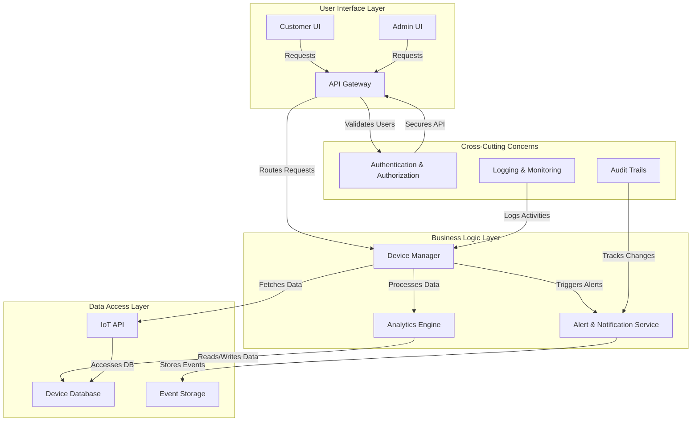

```mermaid
graph TD;
  subgraph UI[User Interface Layer]
    A[Customer UI] -->|Requests| B[API Gateway]
    C[Admin UI] -->|Requests| B
  end

  subgraph BL[Business Logic Layer]
    D[Device Manager]
    E[Analytics Engine]
    F[Alert & Notification Service]
  end

  subgraph DAL[Data Access Layer]
    G[IoT API]
    H[Device Database]
    I[Event Storage]
  end

  subgraph CrossCutting[Cross-Cutting Concerns]
    J[Authentication & Authorization]
    K[Logging & Monitoring]
    L[Audit Trails]
  end

  B -->|Routes Requests| D
  B -->|Validates Users| J
  D -->|Processes Data| E
  D -->|Triggers Alerts| F
  E -->|Reads/Writes Data| H
  F -->|Stores Events| I
  D -->|Fetches Data| G
  G -->|Accesses DB| H
  J -->|Secures API| B
  K -->|Logs Activities| D
  L -->|Tracks Changes| F
```
