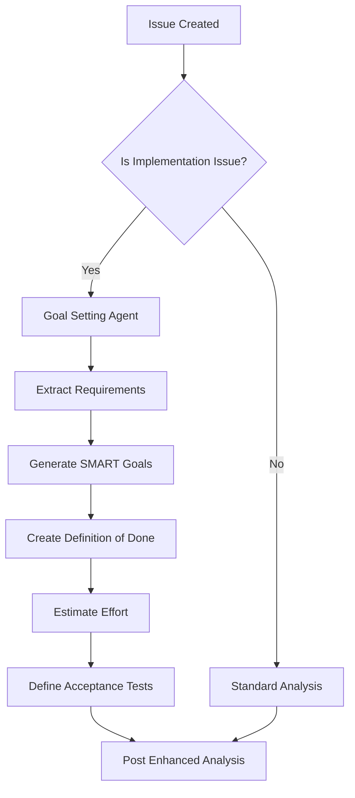

# Goal Setting with Definition of Done

**Type of Thought**: Goal Setting  
**Purpose**: Automatically generate SMART acceptance criteria and Definition of Done for implementation issues

---

## Overview

Goal Setting enhances issue analysis by:
1. Defining clear, measurable success criteria
2. Converting vague requirements into testable conditions
3. Establishing Definition of Done (DoD) for implementation issues
4. Ensuring SMART criteria (Specific, Measurable, Achievable, Relevant, Time-bound)
5. Breaking down work into verifiable checkpoints

---

## Problem Statement

**Common Issue Quality Problems**:
- ❌ "Improve performance" (not measurable)
- ❌ "Fix the bug" (no success criteria)
- ❌ "Add feature X" (no acceptance tests defined)
- ❌ "Refactor code" (no completion criteria)

**Goal Setting Solution**:
- ✅ "Reduce API response time from 500ms to <200ms (P95)"
- ✅ "Bug fixed when: (1) reproduction steps no longer crash, (2) unit test added, (3) deployed to production"
- ✅ "Feature complete when: [detailed DoD checklist]"
- ✅ "Refactoring complete when: [measurable code quality metrics]"

---

## Architecture



---

## Implementation

### 1. Goal Setting Prompt Template

**Location**: `SuperPrompt/goal_setting_system_prompt.txt`

```text
You are a Goal Setting specialist for software development issues.

Your task: Transform vague requirements into SMART, testable Definition of Done.

## SMART Criteria

**Specific**: Clear and unambiguous
- ❌ "Improve performance"
- ✅ "Reduce /api/users response time from 500ms to <200ms at P95"

**Measurable**: Concrete metrics and tests
- ❌ "Make it faster"
- ✅ "Benchmark shows improvement from baseline: load test with 100 concurrent users"

**Achievable**: Realistic given constraints
- ❌ "Rewrite entire system in Rust"
- ✅ "Optimize Python hot paths identified by profiler"

**Relevant**: Aligned with project goals
- ❌ "Add blockchain integration" (for a simple CRUD app)
- ✅ "Add database indexes on frequently queried columns"

**Time-bound**: Estimated effort and timeline
- ❌ "Eventually implement"
- ✅ "Estimated 3-5 days; target completion in current sprint"

## Definition of Done Template

For each issue, generate:

```yaml
definition_of_done:
  functionality:
    - [ ] Core feature implemented per specification
    - [ ] Edge cases handled (empty input, null values, etc.)
    - [ ] Error handling with appropriate messages
    
  quality:
    - [ ] Unit tests added (coverage >80%)
    - [ ] Integration tests for critical paths
    - [ ] Manual testing checklist completed
    
  code:
    - [ ] Code review approved
    - [ ] Linting passes (Ruff/Black)
    - [ ] No new security warnings (CodeQL)
    - [ ] Documentation updated (docstrings, README)
    
  deployment:
    - [ ] Deployed to staging
    - [ ] Smoke tests pass
    - [ ] Production deployment plan reviewed
    - [ ] Rollback plan documented
    
  verification:
    - [ ] Acceptance criteria met (see below)
    - [ ] No regression in existing functionality
    - [ ] Performance benchmarks within target
    
acceptance_criteria:
  - GIVEN [precondition]
    WHEN [action]
    THEN [expected result]
    
estimated_effort: X hours/days
risk_factors:
  - [Potential blocker 1]
  - [Dependency on external system]
```

## Issue-Type-Specific Templates

### Bug Fix
```yaml
definition_of_done:
  reproduction:
    - [ ] Bug reproduced in local environment
    - [ ] Reproduction steps documented
    - [ ] Root cause identified
    
  fix:
    - [ ] Code change fixes root cause
    - [ ] Does not introduce new issues
    - [ ] Regression test added
    
  verification:
    - [ ] Original reporter confirms fix
    - [ ] Related bugs checked (similar issues)
    - [ ] Deployed to affected environments
```

### Feature Request
```yaml
definition_of_done:
  requirements:
    - [ ] Use cases documented
    - [ ] User stories defined (As a X, I want Y, so that Z)
    - [ ] Acceptance criteria agreed upon
    
  implementation:
    - [ ] Core functionality complete
    - [ ] UI/UX matches mockups (if applicable)
    - [ ] API endpoints follow REST conventions
    
  testing:
    - [ ] Unit tests >80% coverage
    - [ ] Integration tests for happy path + edge cases
    - [ ] User acceptance testing (UAT) passed
    
  documentation:
    - [ ] User-facing documentation updated
    - [ ] API docs generated (Swagger/OpenAPI)
    - [ ] Release notes drafted
```

### Epic
```yaml
definition_of_done:
  planning:
    - [ ] Epic broken into sub-issues (Change Requests/Tasks)
    - [ ] Dependencies mapped
    - [ ] Timeline estimated with milestones
    
  sub_issues:
    - [ ] Issue #X: [Description] (Status: Open/In Progress/Done)
    - [ ] Issue #Y: [Description] (Status: Open/In Progress/Done)
    - [ ] Issue #Z: [Description] (Status: Open/In Progress/Done)
    
  integration:
    - [ ] All sub-issues completed
    - [ ] Integration testing across components
    - [ ] End-to-end scenarios validated
    
  delivery:
    - [ ] Epic-level acceptance criteria met
    - [ ] Stakeholder demo/review completed
    - [ ] Production deployment successful
```

### Change Request (Implementation)
```yaml
definition_of_done:
  specification:
    - [ ] Requirements clarified with stakeholder
    - [ ] Technical approach documented
    - [ ] Alternative approaches considered
    
  implementation:
    - [ ] Code implements specification
    - [ ] Unit tests pass (coverage >80%)
    - [ ] Integration tests pass
    - [ ] Performance within acceptable range
    
  review:
    - [ ] Code review approved by 2+ reviewers
    - [ ] Security review (if touching auth/data)
    - [ ] Architecture review (if significant change)
    
  documentation:
    - [ ] Inline code comments for complex logic
    - [ ] README updated (if user-facing)
    - [ ] Architecture diagrams updated (if structural)
    
  deployment:
    - [ ] Deployed to staging
    - [ ] QA testing complete
    - [ ] Production rollout plan approved
    - [ ] Monitoring/alerting configured
```
```

---

### 2. Goal Setting Analyzer Module

**Location**: `my_chat_gpt_utils/goal_setting.py`

```python
"""Goal Setting module for generating Definition of Done."""

from dataclasses import dataclass
from typing import List, Optional
import yaml

from my_chat_gpt_utils.llm_client import call_llm
from my_chat_gpt_utils.prompts import load_prompt


@dataclass
class DefinitionOfDone:
    """Represents a Definition of Done for an issue."""
    
    functionality: List[str]
    quality: List[str]
    code: List[str]
    deployment: List[str]
    verification: List[str]
    acceptance_criteria: List[str]
    estimated_effort: str
    risk_factors: List[str]
    
    def to_markdown(self) -> str:
        """Convert DoD to markdown checklist format."""
        sections = {
            "Functionality": self.functionality,
            "Quality": self.quality,
            "Code": self.code,
            "Deployment": self.deployment,
            "Verification": self.verification,
        }
        
        md = ["## Definition of Done\n"]
        
        for section_name, items in sections.items():
            md.append(f"### {section_name}")
            for item in items:
                md.append(f"- [ ] {item}")
            md.append("")
        
        md.append("### Acceptance Criteria")
        for criterion in self.acceptance_criteria:
            md.append(f"- {criterion}")
        md.append("")
        
        md.append(f"**Estimated Effort**: {self.estimated_effort}\n")
        
        if self.risk_factors:
            md.append("### Risk Factors")
            for risk in self.risk_factors:
                md.append(f"- ⚠️ {risk}")
        
        return "\n".join(md)


class GoalSettingAgent:
    """Agent for generating SMART goals and Definition of Done."""
    
    def __init__(self, llm_provider: str = "openai", model: str = "gpt-4o-mini"):
        self.llm_provider = llm_provider
        self.model = model
        self.system_prompt = load_prompt("goal_setting_system_prompt.txt")
    
    def generate_dod(
        self,
        issue_type: str,
        issue_title: str,
        issue_body: str,
        complexity: str = "moderate"
    ) -> DefinitionOfDone:
        """
        Generate Definition of Done for an issue.
        
        Args:
            issue_type: Type of issue (Bug Fix, Feature Request, Epic, etc.)
            issue_title: Issue title
            issue_body: Issue description
            complexity: Estimated complexity (simple, moderate, complex)
        
        Returns:
            DefinitionOfDone object
        """
        user_prompt = self._build_user_prompt(
            issue_type, issue_title, issue_body, complexity
        )
        
        response = call_llm(
            provider=self.llm_provider,
            model=self.model,
            system_prompt=self.system_prompt,
            user_prompt=user_prompt,
            temperature=0.1,  # Low temperature for consistency
            max_tokens=2048
        )
        
        # Parse YAML response
        dod_data = yaml.safe_load(response)
        
        return DefinitionOfDone(
            functionality=dod_data.get("functionality", []),
            quality=dod_data.get("quality", []),
            code=dod_data.get("code", []),
            deployment=dod_data.get("deployment", []),
            verification=dod_data.get("verification", []),
            acceptance_criteria=dod_data.get("acceptance_criteria", []),
            estimated_effort=dod_data.get("estimated_effort", "Unknown"),
            risk_factors=dod_data.get("risk_factors", [])
        )
    
    def _build_user_prompt(
        self,
        issue_type: str,
        issue_title: str,
        issue_body: str,
        complexity: str
    ) -> str:
        """Build user prompt for goal setting."""
        return f"""
## Type of Thought: Goal Setting

Generate a comprehensive Definition of Done for the following issue.

**Issue Type**: {issue_type}
**Complexity**: {complexity}
**Title**: {issue_title}

**Description**:
{issue_body}

**Requirements**:
1. Make success criteria SPECIFIC and MEASURABLE
2. Include concrete acceptance tests (GIVEN/WHEN/THEN format)
3. Estimate effort realistically (hours or days)
4. Identify potential risks and blockers
5. Use issue-type-specific template ({issue_type})

**Output Format**: YAML (as defined in system prompt)
"""

    def enhance_issue_with_goals(
        self,
        issue_analysis: dict,
        issue_title: str,
        issue_body: str
    ) -> dict:
        """
        Enhance existing issue analysis with goal setting.
        
        Args:
            issue_analysis: Existing analysis result (from analyze_issue.py)
            issue_title: Issue title
            issue_body: Issue description
        
        Returns:
            Enhanced analysis with Definition of Done
        """
        # Only generate DoD for implementation issues
        implementation_types = [
            "Change Request",
            "Feature Request",
            "Epic",
            "Bug Fix"
        ]
        
        issue_type = issue_analysis.get("issue_type", "")
        if issue_type not in implementation_types:
            return issue_analysis  # No DoD needed for questions, discussions
        
        complexity = issue_analysis.get("complexity", "moderate").lower()
        
        # Generate Definition of Done
        dod = self.generate_dod(
            issue_type=issue_type,
            issue_title=issue_title,
            issue_body=issue_body,
            complexity=complexity
        )
        
        # Add to analysis
        issue_analysis["definition_of_done"] = dod.to_markdown()
        issue_analysis["smart_goals"] = {
            "specific": self._is_specific(issue_body),
            "measurable": bool(dod.acceptance_criteria),
            "achievable": complexity in ["simple", "moderate"],
            "relevant": True,  # Assume relevant if issue was created
            "time_bound": bool(dod.estimated_effort != "Unknown")
        }
        
        return issue_analysis
    
    def _is_specific(self, text: str) -> bool:
        """Heuristic: Check if description is specific enough."""
        # Simple heuristic: length and presence of details
        word_count = len(text.split())
        has_details = any(
            keyword in text.lower()
            for keyword in ["when", "should", "must", "requirement", "criteria"]
        )
        return word_count > 50 and has_details


# Example usage
if __name__ == "__main__":
    agent = GoalSettingAgent()
    
    # Example: Feature Request
    dod = agent.generate_dod(
        issue_type="Feature Request",
        issue_title="Add user authentication to API",
        issue_body="""
        We need to add JWT-based authentication to protect API endpoints.
        Users should be able to register, login, and receive tokens.
        """,
        complexity="moderate"
    )
    
    print(dod.to_markdown())
```

---

### 3. Integration with Issue Analyzer Workflow

**Updated Workflow**: `.github/workflows/issue-analyzer.yml`

```yaml
# Existing workflow steps...

- name: Run issue analyzer
  env:
    LLM_PROVIDER: openai
    LLM_MODEL: gpt-4o-mini
    OPENAI_API_KEY: ${{ secrets.OPENAI_API_KEY }}
    GITHUB_TOKEN: ${{ secrets.GITHUB_TOKEN }}
  run: |
    python .github/scripts/analyze_issue.py

# NEW: Goal Setting enhancement
- name: Generate Definition of Done
  if: contains(fromJSON('["Change Request", "Feature Request", "Epic", "Bug Fix"]'), steps.analyze.outputs.issue_type)
  env:
    OPENAI_API_KEY: ${{ secrets.OPENAI_API_KEY }}
  run: |
    python .github/scripts/generate_definition_of_done.py
```

**New Script**: `.github/scripts/generate_definition_of_done.py`

```python
"""
Generate Definition of Done for implementation issues.
Run after initial issue analysis to enhance with goal setting.
"""

import os
import yaml
from my_chat_gpt_utils.goal_setting import GoalSettingAgent
from my_chat_gpt_utils.github_utils import (
    get_issue_details,
    post_comment,
    get_workflow_issue_number
)


def main():
    """Generate and post Definition of Done."""
    issue_number = get_workflow_issue_number()
    token = os.environ["GITHUB_TOKEN"]
    repo = os.environ["GITHUB_REPOSITORY"]
    
    # Get issue details
    issue = get_issue_details(repo, issue_number, token)
    
    # Load previous analysis (if available)
    # In practice, this would be passed from the analyzer step
    # For now, we'll run goal setting independently
    
    agent = GoalSettingAgent(
        llm_provider="openai",
        model="gpt-4o-mini"
    )
    
    # Generate DoD
    dod = agent.generate_dod(
        issue_type="Change Request",  # Would come from analysis
        issue_title=issue["title"],
        issue_body=issue["body"],
        complexity="moderate"  # Would come from analysis
    )
    
    # Post as comment
    comment_body = f"""
## 🎯 Goal Setting Analysis

{dod.to_markdown()}

---
*This Definition of Done was automatically generated by the Goal Setting agent.*
*Feel free to adjust based on specific requirements.*
"""
    
    post_comment(repo, issue_number, token, comment_body)
    print(f"Posted Definition of Done to issue #{issue_number}")


if __name__ == "__main__":
    main()
```

---

## Example Outputs

### Example 1: Feature Request

**Input Issue**:
```
Title: Add user authentication to API endpoints
Body: We need to secure our API. Users should log in with username/password.
```

**Generated DoD**:
```markdown
## Definition of Done

### Functionality
- [ ] Users can register with email and password
- [ ] Users can log in and receive JWT token
- [ ] Protected endpoints require valid JWT token
- [ ] Token expiration handled (15 min access, 7 day refresh)
- [ ] Logout functionality (token invalidation)
- [ ] Password reset flow implemented

### Quality
- [ ] Unit tests for auth service (>80% coverage)
- [ ] Integration tests for login/register flows
- [ ] Security tests (SQL injection, XSS, CSRF)
- [ ] Load testing (1000 concurrent logins)

### Code
- [ ] Code review approved (2+ reviewers)
- [ ] No hardcoded secrets (use environment variables)
- [ ] Passwords hashed with bcrypt (cost factor 12)
- [ ] Rate limiting on auth endpoints (5 attempts/minute)

### Deployment
- [ ] Environment variables configured (JWT_SECRET)
- [ ] Database migrations applied (users table)
- [ ] Monitoring added (auth failures, token expiry)
- [ ] Deployed to staging and tested

### Verification
- [ ] Acceptance criteria met (see below)
- [ ] Postman collection updated with auth examples
- [ ] Documentation updated (API.md)

### Acceptance Criteria
- GIVEN an unregistered user WHEN they POST /register with valid email/password THEN they receive 201 Created and user ID
- GIVEN a registered user WHEN they POST /login with correct credentials THEN they receive 200 OK and JWT token
- GIVEN a valid JWT token WHEN they GET /protected/resource THEN they receive 200 OK and resource data
- GIVEN an expired token WHEN they access protected endpoint THEN they receive 401 Unauthorized
- GIVEN invalid credentials WHEN they attempt login 5 times THEN they are rate-limited for 1 minute

**Estimated Effort**: 3-5 days

### Risk Factors
- ⚠️ Security vulnerabilities if not implemented correctly (follow OWASP guidelines)
- ⚠️ Database schema changes may require migration testing
- ⚠️ Token management complexity (refresh tokens, revocation)
```

---

### Example 2: Bug Fix

**Input Issue**:
```
Title: Fix memory leak in background worker
Body: The worker process crashes after 6 hours with OOM error.
```

**Generated DoD**:
```markdown
## Definition of Done

### Reproduction
- [ ] Memory leak reproduced in local environment
- [ ] Memory profiling performed (tracemalloc, memory_profiler)
- [ ] Root cause identified (e.g., unreleased connections, growing cache)

### Fix
- [ ] Code change addresses root cause
- [ ] Memory usage verified stable over 24 hour test
- [ ] No new memory leaks introduced
- [ ] Regression test added (monitors memory over time)

### Verification
- [ ] Original reproduction steps no longer cause OOM
- [ ] Memory usage stays below threshold (e.g., <500MB)
- [ ] Worker runs successfully for 48+ hours
- [ ] Deployed to staging and monitored

### Acceptance Criteria
- GIVEN worker running with typical load WHEN monitored for 24 hours THEN memory usage increases by <5%
- GIVEN worker processing 1000 tasks WHEN memory profiled THEN no objects are leaked between tasks
- GIVEN previous OOM scenario WHEN reproduced THEN worker completes successfully

**Estimated Effort**: 2-3 days

### Risk Factors
- ⚠️ Fix may impact performance (trade-off between memory and speed)
- ⚠️ Root cause may be in third-party library (requires workaround)
- ⚠️ Testing requires extended monitoring (not instant validation)
```

---

## Benefits

### For Developers
- ✅ **Clear Success Criteria**: Know exactly when work is complete
- ✅ **Prevents Scope Creep**: DoD defines boundaries
- ✅ **Reduces Back-and-Forth**: Acceptance criteria agreed upfront
- ✅ **Better Estimates**: Detailed breakdown improves accuracy

### For Reviewers
- ✅ **Structured Review**: Checklist makes reviews systematic
- ✅ **Quality Assurance**: Ensures tests, docs, deployment considered
- ✅ **Risk Awareness**: Flags potential blockers early

### For Stakeholders
- ✅ **Transparency**: Understand scope and effort
- ✅ **Predictability**: SMART goals enable planning
- ✅ **Verification**: Acceptance tests provide confidence

---

## Testing Strategy

1. **Unit Tests** (`tests/test_goal_setting.py`):
   - Test DoD generation for each issue type
   - Validate YAML parsing
   - Check SMART criteria detection

2. **Integration Tests**:
   - End-to-end workflow test
   - Verify DoD posted as comment
   - Check formatting and completeness

3. **Manual Review**:
   - Compare AI-generated DoD with human-written DoD
   - Measure improvement in issue clarity
   - Collect developer feedback

---

## Metrics for Success

1. **Issue Quality**: % of issues with complete acceptance criteria (target: 80%+)
2. **Developer Satisfaction**: Survey score on usefulness (target: 4/5+)
3. **Time Savings**: Reduction in clarification comments (target: 30%+)
4. **Scope Creep**: % of issues that expand beyond DoD (target: <10%)

---

## Conclusion

Goal Setting with Definition of Done transforms vague issue descriptions into actionable, testable specifications. By explicitly modeling "Goal Setting" as a Type of Thought, we:
- Improve issue quality and clarity
- Reduce ambiguity and miscommunication
- Enable better planning and estimation
- Increase likelihood of successful implementation

This implementation demonstrates the practical value of the "Type of Thought" concept for real-world software development workflows.

---

**Status**: Design Complete - Ready for Implementation  
**Next Steps**:
1. Implement `my_chat_gpt_utils/goal_setting.py`
2. Create `SuperPrompt/goal_setting_system_prompt.txt`
3. Add workflow integration
4. Test with real issues, gather feedback
