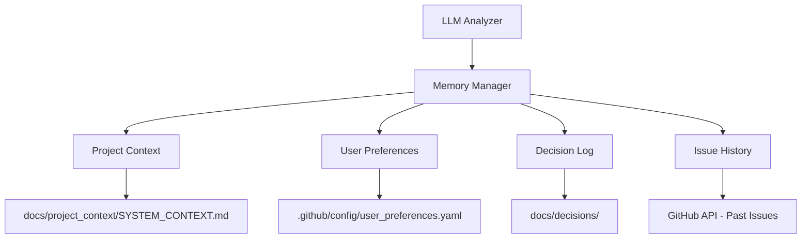

# Memory Integration Design

**Type of Thought**: Memory Integration  
**Purpose**: Enable LLM agents to recall and utilize project context, user preferences, and historical decisions in issue analysis

---

## Overview

Memory Integration allows the issue analyzer to:
1. Remember project architecture and conventions
2. Recall user preferences (e.g., Python over JavaScript)
3. Reference historical decisions and their rationale
4. Maintain context across multiple issues
5. Avoid repeating past mistakes or re-litigating settled decisions

---

## Architecture

### Memory Sources



### Memory Types

| Memory Type | Source | Update Frequency | Example |
|-------------|--------|------------------|---------|
| **Project Context** | Static markdown file | Manual updates | Architecture, tech stack, conventions |
| **User Preferences** | YAML config | Per-user basis | Language preferences, notification settings |
| **Decision Log** | Markdown files (ADR pattern) | When decisions made | "Why we chose FastAPI over Flask" |
| **Issue History** | GitHub API | Real-time | Past similar issues, resolution patterns |

---

## Implementation

### 1. Project Context File

**Location**: `docs/project_context/SYSTEM_CONTEXT.md`

```markdown
# Project Context for AI Agents

## Project Identity
- **Name**: my_chat_gpt
- **Purpose**: AI-powered GitHub issue automation and LLM utilities
- **Primary Language**: Python 3.12+
- **Key Technologies**: OpenAI API, GitHub Actions, PyGithub

## Architecture Overview


## Active Components
1. **Issue Analyzer**: Automatically reviews issues for quality (GPT-4o-mini)
2. **Duplicate Detector**: Uses embeddings to find similar issues
3. **Review Workflow**: Posts structured feedback on new issues

## Conventions & Standards
- **Issue Labels**: Type, Priority, Complexity (auto-applied)
- **Branch Naming**: `feature/`, `bugfix/`, `docs/`
- **Testing**: pytest with >80% coverage requirement
- **Linting**: Ruff + Black for Python code

## Known Limitations
- API rate limits: 60 requests/hour (unauthenticated GitHub API)
- OpenAI costs: Monitor usage, prefer GPT-4o-mini over GPT-4
- No local LLM support (cloud-only currently)

## Recent Decisions
- 2024-11: Chose GPT-4o-mini over GPT-4 for cost efficiency
- 2024-10: Implemented YAML output format for structured parsing
- 2024-09: Switched from Anthropic Claude to OpenAI for consistency

## Out of Scope
- Real-time chat interfaces (focus on automation)
- Local LLM deployment (cloud-first approach)
- Multi-repository management (single-repo focus)
```

### 2. Memory Integration in Prompts

**Updated System Prompt** (pseudo-code):

```python
# my_chat_gpt_utils/analyze_issue.py

def load_memory_context() -> dict:
    """Load project context for memory integration."""
    return {
        "project_context": read_file("docs/project_context/SYSTEM_CONTEXT.md"),
        "user_preferences": load_yaml(".github/config/user_preferences.yaml"),
        "recent_decisions": load_decision_log("docs/decisions/", limit=5),
        "similar_issues": fetch_similar_issues(current_issue, limit=3)
    }

def build_system_prompt_with_memory() -> str:
    memory = load_memory_context()
    
    return f"""
You are an expert GitHub issue reviewer with access to project memory.

## Memory Integration
<Project_Context>
{memory['project_context']}
</Project_Context>

<User_Preferences>
{memory['user_preferences']}
</User_Preferences>

<Recent_Decisions>
{memory['recent_decisions']}
</Recent_Decisions>

<Similar_Past_Issues>
{memory['similar_issues']}
</Similar_Past_Issues>

When analyzing issues:
1. **Check alignment** with project architecture and tech stack
2. **Reference past decisions** to avoid re-litigating settled questions
3. **Learn from similar issues** - how were they resolved?
4. **Respect user preferences** - suggest solutions in preferred languages/frameworks
5. **Maintain consistency** with existing conventions

## Your Review Task
[... rest of prompt ...]
"""
```

### 3. User Preferences Configuration

**Location**: `.github/config/user_preferences.yaml`

```yaml
# User Preferences for AI Agents

default:
  language_preference: python
  framework_preference: fastapi
  testing_framework: pytest
  code_style: black
  notification_level: all_issues

issue_author_overrides:
  pkuppens:
    language_preference: python
    notification_level: mentions_only
    
  contributor_1:
    language_preference: javascript
    framework_preference: react

project_wide:
  min_test_coverage: 80
  require_type_hints: true
  max_issue_complexity: moderate
  auto_label: true
  auto_assign: false
```

### 4. Decision Log (ADR Pattern)

**Location**: `docs/decisions/001-use-gpt4o-mini.md`

```markdown
# ADR 001: Use GPT-4o-mini for Issue Analysis

**Date**: 2024-11-15  
**Status**: Accepted  
**Deciders**: @pkuppens, @team  
**Consulted**: OpenAI documentation  

## Context
Need to choose an LLM for automated issue analysis. Options:
1. GPT-4 (expensive, high quality)
2. GPT-4o-mini (cost-effective, good quality)
3. Claude 3.5 (alternative provider)

## Decision
Use **GPT-4o-mini** as primary model for issue analysis.

## Rationale
- **Cost**: 10x cheaper than GPT-4 ($0.15 vs $1.50 per 1M tokens)
- **Quality**: Sufficient for structured tasks (issue classification, review)
- **Speed**: Faster response times (lower latency)
- **Reliability**: OpenAI's infrastructure proven for production

## Consequences
**Positive**:
- Lower operational costs
- Faster user feedback
- Can analyze more issues with same budget

**Negative**:
- May miss nuanced issues that GPT-4 would catch
- Less sophisticated reasoning for complex problems

**Mitigations**:
- Use GPT-4 for escalated/complex issues (future enhancement)
- Monitor quality metrics (false positive/negative rates)
- Iterate on prompts to maximize GPT-4o-mini effectiveness

## References
- [OpenAI Pricing](https://openai.com/pricing)
- [Model Comparison Results](../testing/model_comparison_2024-11.md)
```

### 5. Integration Example

**Real-World Scenario**:

```yaml
# New Issue Submitted
Title: "Add support for local LLM models"
Body: "We should support running Llama locally instead of cloud-only OpenAI"

# Analyzer Runs with Memory Integration

<Memory_Integration>
RECALLED: docs/project_context/SYSTEM_CONTEXT.md
  - "Out of Scope: Local LLM deployment (cloud-first approach)"

RECALLED: docs/decisions/002-cloud-first-strategy.md
  - Decision made 2024-09: Focus on cloud APIs for simplicity
  - Rationale: Local deployment adds complexity, hardware requirements
  - Reviewed and accepted by team

SIMILAR_PAST_ISSUES:
  - Issue #42: "Support Anthropic Claude" (Closed as duplicate)
  - Issue #38: "Add OpenAI alternative" (Closed: out of scope)
</Memory_Integration>

# Analyzer Response

## Analysis
This issue requests local LLM support. However:

**Memory Integration Findings**:
1. ⚠️ **Conflicts with established decision** (ADR 002: Cloud-First Strategy)
2. 📋 **Similar past issues** were closed as out-of-scope (#42, #38)
3. 🎯 **Project explicitly excludes** local deployment per SYSTEM_CONTEXT.md

## Recommendation
**CLOSE as "Won't Fix"** or **RE-OPEN Decision Discussion**

**Rationale**:
- This conflicts with an explicit architectural decision (ADR 002)
- Team previously decided cloud-first approach (2024-09)
- Adding local LLM support requires:
  - Hardware requirements (GPU)
  - Model management (downloads, updates)
  - Inference optimization (latency, throughput)
  - Testing across different models
  
**Alternative**:
If there's new information or changed circumstances:
1. Open a discussion issue to re-evaluate ADR 002
2. Present concrete use cases (e.g., air-gapped environments, privacy requirements)
3. Propose phased approach (cloud primary, local optional)

**If proceeding**:
- Estimated complexity: High (3-4 weeks)
- Requires: Architecture review, team consensus
- Related: May need to refactor analyzer to support multiple backends
```

---

## Benefits

### For Users
- ✅ **Consistent Recommendations**: AI remembers past decisions
- ✅ **Personalized Feedback**: Respects language preferences
- ✅ **Avoids Redundancy**: References similar resolved issues
- ✅ **Faster Resolution**: Learns from project history

### For Maintainers
- ✅ **Reduces Manual Triage**: AI recalls project scope automatically
- ✅ **Enforces Decisions**: ADRs automatically inform analysis
- ✅ **Knowledge Preservation**: Context survives team changes
- ✅ **Improved Accuracy**: More context = better recommendations

---

## Implementation Phases

### Phase 1: Static Memory (Simple)
**Effort**: 4 hours  
**Components**:
- Create `SYSTEM_CONTEXT.md`
- Modify prompt to include static context
- Test with 10 real issues

### Phase 2: Decision Logs (Moderate)
**Effort**: 1-2 days  
**Components**:
- Set up ADR directory structure
- Load recent decisions into prompt
- Add conflict detection logic

### Phase 3: User Preferences (Moderate)
**Effort**: 1-2 days  
**Components**:
- Create `user_preferences.yaml` schema
- Parse issue author → load preferences
- Apply preferences in recommendations

### Phase 4: Dynamic Memory (Complex)
**Effort**: 1 week  
**Components**:
- GitHub API integration for past issues
- Embedding-based similarity search
- Reference relevant past resolutions

---

## Testing Strategy

### Test Cases

1. **Memory Recall Test**
   - Given: Issue requests out-of-scope feature
   - When: Analyzer runs with memory integration
   - Then: References `SYSTEM_CONTEXT.md` "Out of Scope" section
   - Expected: Recommends closing with rationale

2. **Preference Application Test**
   - Given: User prefers Python, issue suggests JavaScript
   - When: Analyzer reviews implementation suggestion
   - Then: Loads user preference, suggests Python alternative
   - Expected: "Consider Python implementation using FastAPI instead"

3. **Decision Conflict Test**
   - Given: Issue contradicts ADR 002
   - When: Analyzer loads decision log
   - Then: Detects conflict, flags for review
   - Expected: "⚠️ Conflicts with ADR 002 (Cloud-First)"

4. **Similar Issue Reference Test**
   - Given: New bug report similar to #123 (resolved)
   - When: Analyzer searches history
   - Then: Finds #123, references solution
   - Expected: "Similar to #123 - resolved by updating dependencies"

---

## Maintenance

### Keeping Memory Fresh

1. **Project Context**
   - Review quarterly
   - Update when architecture changes
   - Keep concise (< 2000 tokens)

2. **Decision Logs**
   - Add ADR for every significant decision
   - Mark superseded decisions
   - Link to relevant issues/PRs

3. **User Preferences**
   - Allow users to update via issue comments
   - Validate YAML schema on changes
   - Fallback to defaults if missing

4. **Issue History**
   - Automatic (GitHub API)
   - Limit to last 6 months
   - Cache embeddings for performance

---

## Future Enhancements

1. **Learning from Feedback**
   - Track when memory-based recommendations are accepted/rejected
   - Adjust confidence scores over time
   - Surface low-confidence areas for human review

2. **Multi-Project Memory**
   - Share context across related repositories
   - Organization-wide preferences
   - Cross-repo decision references

3. **Temporal Context**
   - "This was decided 2 years ago, consider re-evaluating"
   - Expire old decisions with sunset dates
   - Trend analysis ("3 similar requests this month")

4. **Interactive Memory Updates**
   - Bot responds to commands: `/remember [context]`
   - Users can add context via comments
   - Crowdsourced project knowledge

---

## Example Usage in Issue Review

**Before Memory Integration**:
```
Issue: "Add TypeScript support"
Analysis: 
  - Type: Feature Request
  - Priority: Medium
  - Recommendation: Evaluate TypeScript benefits
```

**After Memory Integration**:
```
Issue: "Add TypeScript support"

<Memory_Integration>
- Project Language: Python 3.12+ (SYSTEM_CONTEXT.md)
- Author Preference: Python (user_preferences.yaml)
- Similar Issue: #56 "Add TypeScript" (Closed: Out of Scope, 2024-08)
- Decision: ADR 004 "Python-First Strategy" (2024-07)
</Memory_Integration>

Analysis:
  - Type: Feature Request
  - Priority: Low (conflicts with established direction)
  - ⚠️ Conflicts: ADR 004 (Python-First), past issue #56 (closed)
  
Recommendation: 
  **CLOSE as "Won't Fix"** 
  
  Rationale: This project maintains a Python-first strategy (ADR 004). 
  A similar request (#56) was previously evaluated and declined.
  Adding TypeScript would require:
  - Build tooling changes
  - Team upskilling
  - Maintenance of two language ecosystems
  
  If circumstances have changed, please:
  1. Open a discussion to re-evaluate ADR 004
  2. Present new use cases not considered previously
  3. Propose migration strategy if approved
```

---

## Conclusion

Memory Integration transforms the issue analyzer from a **stateless classifier** to a **context-aware assistant** that:
- Remembers project history
- Learns from past decisions
- Respects user preferences
- Provides consistent, informed recommendations

This aligns with the "Type of Thought" concept by explicitly modeling **Memory Integration** as a reasoning step, improving both accuracy and user experience.

---

**Status**: Design Complete - Ready for Implementation  
**Next Steps**: 
1. Create `docs/project_context/SYSTEM_CONTEXT.md`
2. Implement context loading in `my_chat_gpt_utils/analyze_issue.py`
3. Test with real issues, measure improvement
