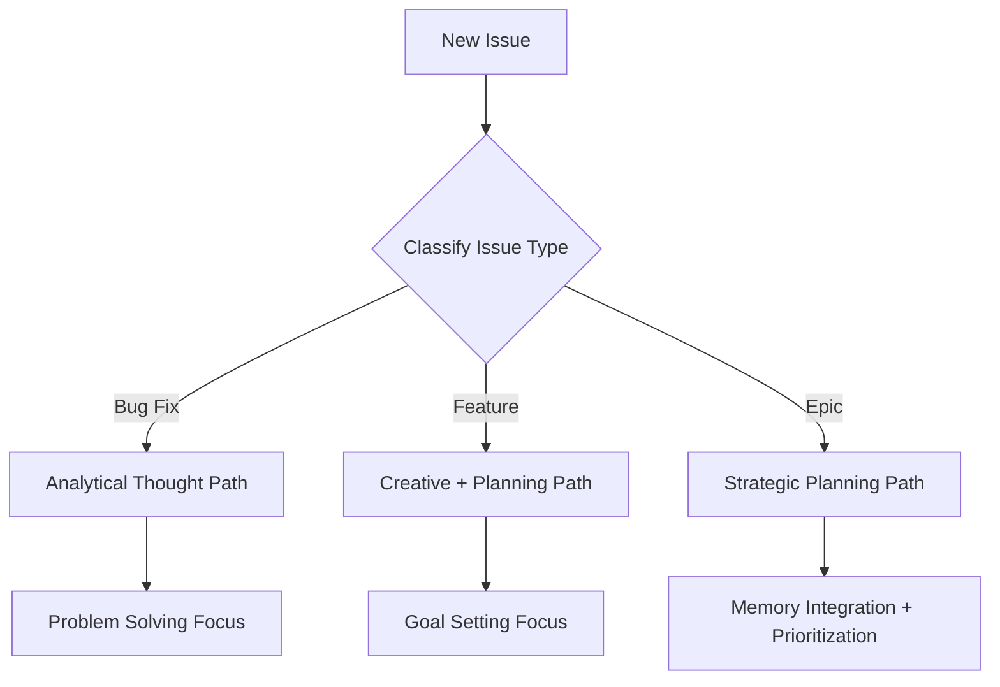

# Evaluation: Type of Thought for Improved LLM Answers

**Date**: February 2026  
**Status**: Analysis & Recommendation  
**Issue Reference**: "Idea: Type of Thought to improve answers"

---

## Executive Summary

**Recommendation**: ⚠️ **REFINE & REFRAME** - The core idea has merit but needs modernization for 2026 AI capabilities.

After analyzing the repository and considering 1+ years of AI agent progress (2024-2026), the "Type of Thought" concept remains **partially viable** but requires significant refinement to align with current state-of-the-art practices.

### Key Findings

1. ✅ **Still Relevant**: Modern AI agents benefit from explicit reasoning structures
2. ⚠️ **Already Implicit**: LLMs like GPT-4o (2024+), Claude 3.5 (2024+), and Gemini 1.5 (2024+) inherently perform these thought types without explicit prompting
3. 🔄 **Needs Update**: The original proposal predates major advances in:
   - Chain-of-thought prompting (standardized 2023-2024)
   - Reasoning tokens (OpenAI o1 series, 2024)
   - Agentic frameworks (LangChain, AutoGPT, Claude Computer Use, 2024+)
   - Multi-turn reasoning patterns
4. ✅ **Implementation Value**: Can still improve determinism and observability in specialized domains

---

## Context: What Changed Since the Original Issue?

### 2024-2025 AI Advances That Impact This Proposal

1. **OpenAI o1/o3 Series (2024-2025)**
   - Native reasoning tokens explicitly model "thinking" steps
   - Automatic chain-of-thought without prompt engineering
   - Makes explicit "Type of Thought" labels less critical

2. **Agentic Frameworks Maturation**
   - LangChain Agents, AutoGPT, and similar tools standardized multi-step reasoning
   - Built-in patterns for planning, analysis, and decision-making
   - Industry-wide best practices emerged

3. **Improved Base Model Capabilities**
   - GPT-4o, Claude 3.5 Sonnet, Gemini 1.5 Pro show strong emergent reasoning
   - Less need for explicit scaffolding compared to GPT-3.5 era
   - Better context utilization (128k+ tokens standard)

4. **GitHub Copilot Agent Mode (2025-2026)**
   - Native integration with development workflows
   - Built-in multi-step planning and execution
   - Demonstrates effective agent patterns in production

### What This Repository Already Has

**Sophisticated Prompting (Without "Type of Thought" Labels)**:
- Role-based instructions ("Expert GitHub issue reviewer")
- Structured output requirements (YAML format)
- SMART criteria frameworks
- Type-specific guidance (Bug vs Feature vs Epic)
- Best practices embedded in prompts

**Missing from Current Implementation**:
- ❌ Explicit reasoning stages (no `<thinking>` or `<analysis>` sections)
- ❌ Thought-type classification system
- ❌ Multi-turn reasoning chains
- ❌ Intermediate step visibility
- ❌ Self-correction loops

---

## Analysis: Is "Type of Thought" Still Valuable?

### ✅ Arguments FOR Implementation

1. **Observability & Debugging**
   - Explicit thought labels make LLM reasoning transparent
   - Easier to debug when analysis goes wrong
   - Helps train users on effective prompting patterns

2. **Determinism & Consistency**
   - Forcing specific thought types can improve output consistency
   - Reduces hallucinations by constraining reasoning paths
   - Better for production systems where reliability matters

3. **Domain-Specific Optimization**
   - GitHub issue analysis benefits from structured thinking
   - Planning → Analysis → Decision Making → Goal Setting is a logical flow
   - Can be tailored to issue types (Bug Fix vs Epic)

4. **Educational Value**
   - Repository includes tutorials (hugging-face-mcp-course)
   - Demonstrates prompt engineering best practices
   - Shows users HOW to think about problems

5. **Hybrid Human-AI Workflows**
   - Makes AI reasoning steps visible for human review
   - Facilitates collaborative problem-solving
   - Enables incremental refinement

### ❌ Arguments AGAINST Implementation

1. **Modern LLMs Already Do This**
   - GPT-4o and Claude 3.5 perform internal reasoning without prompts
   - Adding explicit labels may be redundant overhead
   - Could even degrade performance by over-constraining

2. **Maintenance Burden**
   - Extra prompt complexity to maintain
   - More fragile if LLM behavior changes
   - Requires ongoing tuning and refinement

3. **Limited Measurable Benefit**
   - Hard to quantify improvement over current system
   - May not justify added complexity
   - Current prompts already work well (per ISSUE_REVIEW_WORKFLOW.md)

4. **Alternative Solutions Exist**
   - OpenAI o1 models provide better reasoning natively
   - Agentic frameworks (LangChain) offer more robust patterns
   - Multi-turn conversations can achieve same goals

5. **Scope Creep Risk**
   - Original issue acknowledges it "feels incomplete"
   - Could expand indefinitely with new thought types
   - Unclear stopping criteria

---

## Refined Proposal: Modern "Type of Thought" Implementation

### Option A: Minimal Enhancement (Recommended)

**Add optional reasoning visibility WITHOUT changing core logic**

1. **Modify System Prompt** to include reasoning stages:
   ```yaml
   response_format:
     thinking: |
       [Internal reasoning - describe your analysis approach]
     classification:
       issue_type: ...
       priority: ...
     review_feedback: ...
   ```

2. **Benefits**:
   - ✅ Zero breaking changes
   - ✅ Improves transparency
   - ✅ Optional (can be hidden in UI)
   - ✅ Easy to A/B test

3. **Implementation**: Single prompt file modification

---

### Option B: Full Thought-Type System (Complex)

**Implement explicit thought routing based on issue type**



**Components**:
1. Type-specific prompt templates with thought labels
2. Routing logic based on issue classification
3. Multi-stage analysis (classify → analyze → recommend)
4. Thought-type-aware response validation

**Effort**: 2-3 weeks of development + testing

---

### Option C: Hybrid with Modern Tools

**Leverage OpenAI's reasoning models (o1) for complex issues**

1. **Tiered System**:
   - Simple issues → GPT-4o-mini (fast, cheap)
   - Complex issues → o1-preview (reasoning-optimized)
   - Reasoning automatically captured in completion

2. **Thought Type Mapping**:
   - Map issue complexity → appropriate model
   - Use o1's native reasoning for "Problem Solving" and "Analysis"
   - Use GPT-4o for "Planning" and "Goal Setting"

3. **Benefits**:
   - ✅ Leverages best available tools
   - ✅ Future-proof (scales with new models)
   - ✅ No custom prompt engineering needed

---

## Sample Implementations

### 1. Memory Integration (Simple Example)

**Goal**: Issues should reference prior project context automatically

**Implementation**:
```yaml
# docs/project_context/SYSTEM_CONTEXT.md
Project: my_chat_gpt
Purpose: AI-powered GitHub issue automation
Architecture: 
  - GitHub Actions workflows
  - OpenAI API integration
  - Python-based analyzers
Active Components:
  - Issue analyzer (GPT-4o-mini)
  - Duplicate detector (embeddings)
  - Review workflow automation
```

**Updated Prompt**:
```
## Memory Integration
The user has previously configured this project with the following context:
{load_project_context()}

When analyzing issues, consider:
- Alignment with project architecture
- Compatibility with existing workflows
- Relevant historical decisions
```

**Benefit**: Issues get context-aware feedback without manual user input

---

### 2. Goal Setting with Definition of Done (Moderate Example)

**Goal**: Automatically generate acceptance criteria for implementation issues

**Implementation**:
```python
# my_chat_gpt_utils/goal_setter.py
def generate_definition_of_done(issue_type: str, issue_body: str) -> dict:
    """
    Type of Thought: Goal Setting
    
    Generates SMART acceptance criteria based on issue type and description.
    """
    prompt = f"""
    <Goal_Setting>
    Create a Definition of Done for this {issue_type} issue.
    
    Requirements:
    - Specific: Each criterion must be unambiguous
    - Measurable: Include concrete metrics (e.g., "API response time < 200ms")
    - Achievable: Realistic given typical sprint capacity
    - Relevant: Directly tied to issue objectives
    - Time-bound: Include estimated effort (hours/days)
    
    Issue Description:
    {issue_body}
    
    Output Format:
    definition_of_done:
      - [ ] Criterion 1 (Specific, measurable)
      - [ ] Criterion 2 (Testable)
      - [ ] Criterion 3 (Verifiable)
    estimated_effort: X hours
    acceptance_tests:
      - Test scenario 1
      - Test scenario 2
    </Goal_Setting>
    """
    # Call LLM with goal-setting prompt...
```

**Updated Workflow**:
```yaml
# .github/workflows/issue-analyzer.yml
- name: Generate Definition of Done
  if: github.event.issue.labels.*.name contains 'Type: Change Request'
  run: python .github/scripts/generate_dod.py
```

**Benefit**: Implementation issues automatically get detailed acceptance criteria

---

## Recommendation: Pragmatic Path Forward

### Phase 1: Validate with Minimal Changes (1 week)

1. **Add `<thinking>` section to current prompts**
   - Modify `SuperPrompt/analyze_issue_system_prompt.txt`
   - Request reasoning before classification
   - A/B test with 20 real issues

2. **Measure Impact**:
   - Quality of review feedback (manual review)
   - User satisfaction (GitHub reactions)
   - False positive/negative rates

3. **Decision Point**:
   - ✅ If improvement > 10%: Proceed to Phase 2
   - ❌ If no measurable benefit: Close issue with findings

### Phase 2: Selective Thought-Type Implementation (2 weeks)

1. **Implement 2-3 high-value thought types**:
   - **Memory Integration**: Add project context loading
   - **Goal Setting**: Auto-generate Definition of Done for Change Requests
   - **Problem Solving**: Enhanced debugging guidance for Bug reports

2. **Create Documentation**:
   - `docs/ai_resources/THOUGHT_TYPES.md`
   - Example issues demonstrating each type
   - Best practices guide

3. **Monitor & Iterate**:
   - Collect metrics over 1 month
   - Refine based on real usage
   - Consider expanding to other thought types

### Phase 3: Optional Advanced Features (Future)

- Multi-turn reasoning chains
- Dynamic thought-type selection
- Integration with OpenAI o1 models
- Thought-type visualization in UI

---

## Addressing Original Issue Concerns

The original issue raised 5 important concerns. Here's how we address each:

### 1. "LLMs might already be capable of these Types of Thought?!"

**Answer**: YES, modern LLMs (2024+) have strong emergent reasoning capabilities.

**BUT**: Explicit thought labels still provide value for:
- Observability (debugging failed analyses)
- Consistency (reducing variance in production)
- Education (teaching users effective prompting)
- Domain optimization (GitHub issue analysis has specific patterns)

**Recommendation**: Implement thought types as **optional scaffolding**, not required structure.

---

### 2. "The examples might need more guidance for specific problems"

**Answer**: AGREED. Generic "Planning" is insufficient.

**Refined Examples**:

| Thought Type | Generic Example | GitHub Issue Specific |
|--------------|----------------|----------------------|
| Planning | "Break task into steps" | "This Epic requires 3 Change Requests: API implementation, UI integration, documentation update. Each should be a separate issue with dependencies tracked." |
| Analysis | "Based on error message..." | "This bug report lacks reproduction steps. The error 'NullPointerException' suggests uninitialized variable. Request: OS version, Python version, input data that triggers error." |
| Goal Setting | "Establish acceptance criteria" | "Definition of Done for this Change Request: (1) API returns 200 status, (2) Response time < 200ms, (3) Unit test coverage > 80%, (4) OpenAPI spec updated, (5) Deployment successful in staging." |

**Implementation**: Create issue-type-specific thought templates.

---

### 3. "The list could be extended with 'out-of-scope' or 'rejected alternatives'"

**Answer**: EXCELLENT point. Add **Boundary-Setting** thought type.

**New Thought Type**:
```yaml
Boundary_Setting:
  description: "Explicitly declare what is OUT OF SCOPE or REJECTED"
  examples:
    - "This issue requests both user authentication AND admin dashboard. 
       RECOMMENDATION: Split into two issues. Admin dashboard is out of scope for MVP."
    - "REJECTED ALTERNATIVE: Using WebSockets for real-time updates. 
       RATIONALE: Adds complexity without measurable benefit. 
       CHOSEN APPROACH: Polling every 5 seconds is sufficient for this use case."
  when_to_use:
    - Issue scope is too broad
    - Multiple implementation approaches possible
    - Risk of feature creep
```

---

### 4. "Can I benefit from interactions between thoughts?"

**Answer**: YES! Thought types should form a **reasoning chain**, not isolated steps.

**Interaction Patterns**:


**Example Flow for Complex Issue**:
1. **Planning**: "Break into 3 sub-issues"
2. **Goal Setting**: "Define DoD for each sub-issue"
3. **Analysis**: "Sub-issue 2 depends on external API"
4. **Decision Making**: "Recommend mock API for testing"
5. **Problem Solving**: "Use WireMock for API simulation"
6. **Boundary Setting**: "Integration with real API is out of scope for this sprint"
7. **Self-Reflection**: "Initial plan underestimated external dependency risk"

**Implementation**: Multi-stage prompt with explicit transitions.

---

### 5. "Add thoughts that reduce hallucinations and invalid assumptions"

**Answer**: CRITICAL for production systems. Add **Verification** and **Assumption-Checking** thought types.

**New Thought Types**:

```yaml
Verification:
  description: "Cross-check claims against evidence"
  prompts:
    - "Before concluding, verify: Is this claim supported by the issue description?"
    - "Red flag check: Am I making assumptions about user intent?"
    - "Evidence test: What specific text supports this classification?"
  reduces: Hallucination, over-confidence, misinterpretation

Assumption_Checking:
  description: "Explicitly state and validate assumptions"
  prompts:
    - "ASSUMPTION: User has Python 3.8+ installed. BASIS: Not stated, standard for this project."
    - "ASSUMPTION: Issue author has admin access. BASIS: Issue was labeled 'internal'."
    - "UNCERTAIN: Whether this affects production. ACTION: Request clarification."
  reduces: Invalid assumptions, missing context
```

**Implementation Example**:
```
<Verification>
CLAIM: This is a high-priority bug.
EVIDENCE: Issue title contains "urgent", description says "blocks deployment".
VALIDATED: YES

CLAIM: This affects 100+ users.
EVIDENCE: No user impact metrics provided.
VALIDATED: NO - Assumption without evidence. Recommend lowering priority or requesting data.
</Verification>
```

---

## Conclusion

### Final Recommendation

**✅ IMPLEMENT with Modern Refinements**

1. **Phase 1** (Immediate - 1 week):
   - Add optional `<thinking>` section to prompts
   - Implement Memory Integration (project context loading)
   - A/B test with real issues

2. **Phase 2** (If Phase 1 succeeds - 2 weeks):
   - Add Goal Setting (auto-generate Definition of Done)
   - Add Boundary Setting (out-of-scope detection)
   - Add Verification (hallucination reduction)

3. **Document & Share**:
   - Create `docs/ai_resources/THOUGHT_TYPES.md`
   - Share learnings with AI community
   - Contribute examples to Hugging Face course materials

### Why This Approach?

- ✅ **Low Risk**: Start minimal, expand only if validated
- ✅ **Measurable**: Clear success metrics at each phase
- ✅ **Modern**: Aligned with 2026 AI best practices
- ✅ **Educational**: Demonstrates advanced prompting for community
- ✅ **Practical**: Solves real problems in this repository

### Alternative: If NOT Implementing

If the project team decides not to pursue this:

**Close Issue With**:
- Link to this analysis document
- Acknowledgment that modern LLMs (2024+) handle reasoning better natively
- Recommendation to revisit if/when observability becomes a priority
- Suggestion to explore OpenAI o1 models as alternative

---

## References

1. **Original Inspiration**: [Hugging Face Agents Course - Thoughts](https://huggingface.co/learn/agents-course/unit1/thoughts)
2. **Chain-of-Thought Prompting**: Wei et al., 2022 ([arXiv:2201.11903](https://arxiv.org/abs/2201.11903))
3. **OpenAI o1 System Card**: [OpenAI Documentation](https://openai.com/research/o1)
4. **Repository Context**:
   - `docs/development/ISSUE_REVIEW_WORKFLOW.md` (current implementation)
   - `SuperPrompt/analyze_issue_system_prompt.txt` (existing prompt)
   - `.github/workflows/issue-analyzer.yml` (automation)

---

**Document Status**: Ready for Review  
**Next Steps**: Share with stakeholders → Decide on implementation → Create issues for approved phases
